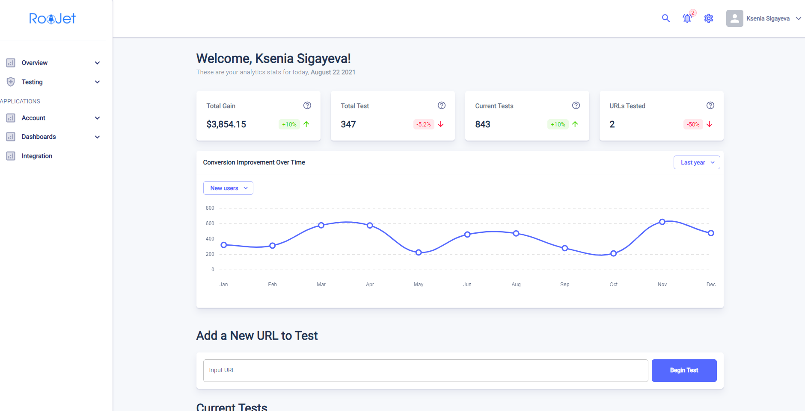

<h1 align="center">
    <a href="#">User Experiment with testing</a>
     
</h1>

<h3 align="center">High performance React template built with lots of powerful Material-UI components across multiple product niches for fast & perfect apps development processes.
</h3>

---

<h2>
    Competitor site is abtesting.ai
</h2>

---

<h2>
    Technical Support
</h2>

    - React/Redux
    - MaterialUI
    - node.js 14.17.3

---

<h2>
    Quick Start
</h2>

    Run <code>npm install</code> inside the project-folder and after the install finished, run <code>npm run start</code>. A browser window will open and you will see the live preview.

